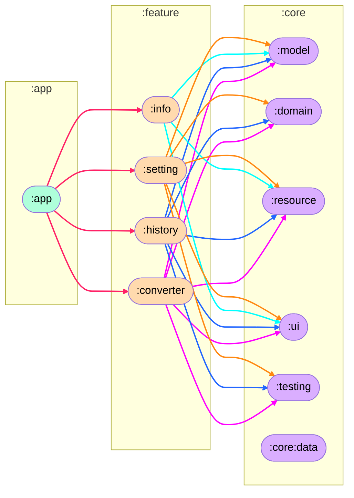

　　

# Hiragana Converter （Japanese: ひらがな変換）

## Summary
This is an Android app that uses gooラボ's API ([Japanese Hiragana Conversion API](https://labs.goo.ne.jp/api/en/hiragana-translation/)) to convert Japanese strings, including kanji and alphabets, into hiragana/katakana.

## Conversion example
|-|text|
|:--|:--|
|Before|漢字とWORDを含む日本語文字列|
|After（Hiragana）|かんじと わーどを ふくむ にほんごもじれつ|
|After（Katakana）|カンジト ワードヲ フクム ニホンゴモジレツ|

## How to perform API communication within the app

1. Get your API key below.  
https://labs.goo.ne.jp/apiusage/  

2. Add the following to the bottom of `local.properties`  
`apiKey=<API key obtained in 1.>`  （Example： apiKey=011222333333abcd）

⚠️　Mock flavor is provided, so if you want to simulate API communication using Mock, you can test it by setting a meaningless value (such as "AAA") in apiKey.

## Typical libraries used  
|Name|Brief description|
|:--|:--|
|Analytics|Firebase analytics|
|App Update|In App Update|
|Coil|Image loading library|
|Crashlytics|Firebase crashlytics|
|Danger|Automatic review|
|Hilt|Dependency Injection|
|Interceptor|Create error response|
|Jacoco|Code coverage library|
|Jetpack Compose|Toolkit for building native UIs in Android|
|Kotlinx serialization|Serializer / Deserializer|
|Ktlint|Formatter|
|Material3|Design|
|Mockk|Unit test mock|
|OSS licenses plugin|OSS Licenses|
|Preferences DataStore|Permanent data|
|Renovate|Automated project dependency updates|
|Retrofit2|Library for API communications|
|Robolectric|Unit Test Framework|
|Room|Database|
|Secrets gradle plugin|Reading API keys from `local.properties`|
|Timber|Log output library|
|Truth|Assertions used in testing|
|Turbine|testing library for kotlinx.coroutines Flow|

## Animation ( Lottie )
- https://lottiefiles.com/animations/loading-Y3Pt36IpkJ
- https://lottiefiles.com/animations/downloading-or-importing-icon-animation-D3lBDrmw1L

## Image
|Conversion screen(Light)|Conversion screen(Dark)|
|:-:|:-:|
|||

|Setting screen(Light)|Setting screen(Dark)|
|:-:|:-:|
|||

|History screen(Light)|History screen(Dark)|
|:-:|:-:|
|||

|Info screen(Light)|Info screen(Dark)|
|:-:|:-:|
|||

## Module Configurations

